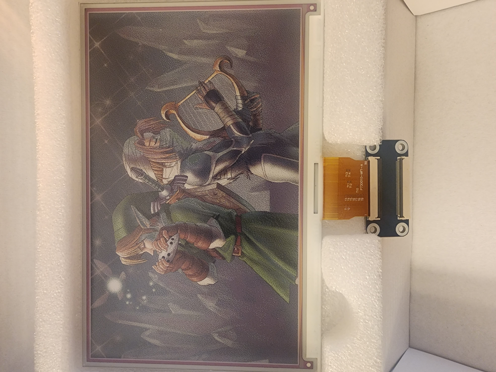

# E-Ink Picture Display in Python

This is a basic Python script for displaying images on a 7.3 inch E-Ink display using the `epd7in3f` library. 



## Table of Contents
- [Prerequisites](#prerequisites)
- [Usage](#usage)
- [Troubleshooting](#troubleshooting)

## Prerequisites
To run this script, you will need the following:

1. Python 3.6 or above
2. [epd7in3f](https://github.com/dazemc/E-Ink_Picture_Frame) library
3. Pillow Library - `pip install pillow`
4. Bitmap (.bmp) images

Make sure that the images you want to display and the `epd7in3f` library are in the same directory as the script.

## Usage

1. Clone the repository:
    ```bash
    git clone https://github.com/dazemc/E-Ink_Picture_Frame.git
    ```
2. Navigate into the repository:
    ```bash
    cd E-Ink_Picture_Frame
    ```
3. Run the script:
    ```bash
    python main.py
    ```
4. To change the images displayed, replace the 'zelda02.bmp', 'zelda01.bmp', and 'zelda00.bmp' in the `pic` directory with the images of your choice. Make sure to update the image file names in the script.

## Troubleshooting
In case of errors, the script will log them in the terminal. If an IO error occurs, the script will log the error details. If the script is interrupted by a keyboard interrupt (ctrl + c), the `epd7in3f` module will exit and the script will terminate.

Please raise an issue on this repository if you face any issues or need further assistance.
